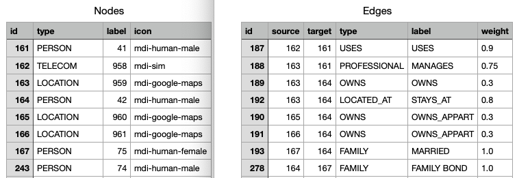
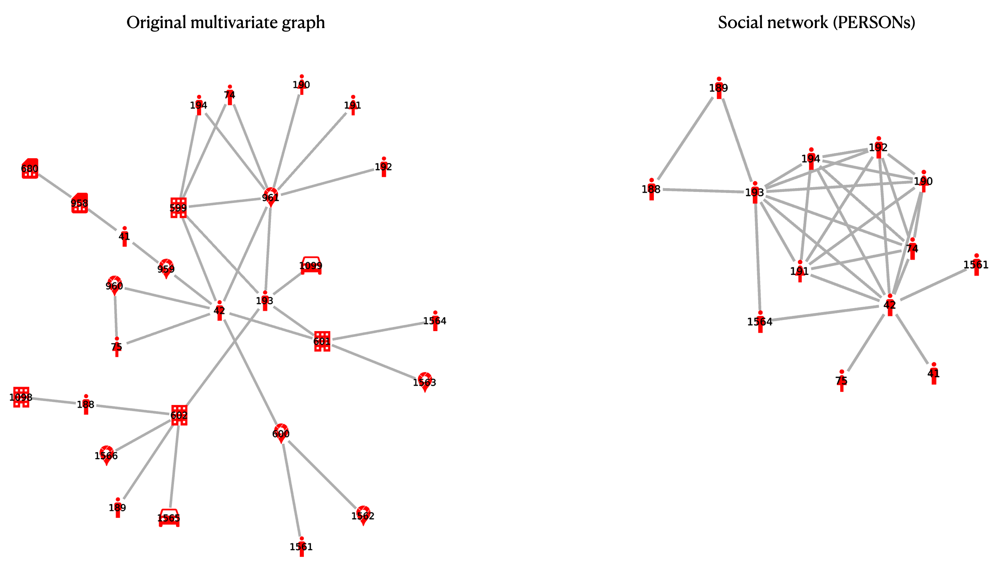

# From criminal investigation data to social network
## Reducing a multivariate multigraph through multiple edge merging and path contraction

This git repository contains a series of python scripts implementing a reduction algorithm, extracting a one-mode social network from a multivariate multigraph, that is one containing nodes and edges of multiple types.

The scripts heavily rely on [Tulip](https://tulip.labri.fr/), a `python` library offering a number of methods to handle graphs and subgraphs.

The script can be used from the command line, handling data files and directly outputting the social network in various formats.

### Reference

This code is companion to a paper submitted to the _Journal of Quantitative Criminology_. An early version of the algorithm was presented at the _EGC French Annual Conference_ in 2023.
	
Bruno Pinaud, Maud Bénichou, Guy Melançon.
Extraction d'un réseau social criminel par transformation d'un graphe d'enquête multivarié.
Conférence Extraction et Gestion des Connaissances (EGC) 2023, Revue RNTI-039. pp.151-162.
Référence HAL hal-03929950.

* _Erratum_. The EGC paper contains a slight mistake concerning the arithmetic operators that can be used
to compute weights on the social network. The proper requirement is to make sure the operators do
form a commutative ring over the reals. The mistake has been properly addressed in
the _Journal of Quantitative Criminology_ version (submitted).


### Data format

The scripts currently support data stored in two distinct csv (_semi-colon separated_) files. A first file stores _nodes_ while a second files stores _edges_ of a multivariate multigraph (MMG).



Nodes:

* must have a unique identifier under a column named `id`;
 * an `id` can take as value an integer or a string;
* must have a `type`, or put differently the name of a category to which the node belong;
* can optionally have a `label` and `icon` that can be used when displaying the graph. The icon value must be an icon name part of the [awesome font family](https://fontawesome.com/).

Edges:

* must have a unique identifier under a column named `id`;
 * an `id` can take as value an integer or a string;
* must specify (in two separate columns) the `source` and `target` nodes they connect; these values must refer to properly defined node identifiers (part of the node file);
* must specify a `weight`, that is a numerical value often normalized to (0, 1];
* may specify an edge `type`, also a numerical value often normalized to (0, 1]; 
* can optionally have a `label` that can be used when displaying the graph.

In practice edge types are used when defining weights of edges. Weights are not assigned to individual edges but rather to edge types.

### Running the script

Once these files are at hand, one can use the `mmg` shell script. The scirpt launches a series of python scripts for which we recommend defininf a proper environment in which all requirements are satisfied.

The script requires a number of parameters to be set that the help option will reveal:

```
./mmg -h

usage: mmg.py [-h] --nodes NODES --edges EDGES [--projected_type PROJECTED_TYPE] --output OUTPUT

Process csv files into a multivariate mutigraph and social network.

optional arguments:
  -h, --help            show this help message and exit
  --nodes NODES         Name of csv file listing nodes of a multivariate multigraph.
  --edges EDGES         Name of csv file listing edges of a multivariate multigraph.
  --projected_type PROJECTED_TYPE
                        Value of node type to reduce the multivariate multigraph to. Default value is
                        PERSON
  --output OUTPUT       File to which resulting graph should be stored.
```

Unsurprisingly, the script requires to provide the names/paths of the node and edge csv files. The value of the type onto which the reduction algorithm works can be optionally set (default is `PERSON`). The script also requires to provide a valid name/path to store the resulting Tulip file.

For example, the script can be test-run on the provided examples files using the command:

`./mmg --nodes 'data/nodes.csv' --edges 'data/edges.csv' --output 'data/Example.tlp'`

The projected type can in this case be omitted since it equates the default type `PERSON`. The resulting multivariate graph contains 28 nodes, among which 13 are of type `PERSON`, and 35 edges. The resulting social network contains 13 nodes (persons) and 29 edges.



### Using the `python`modules

The scripts can also be used as such after proper importation. For instance, the parsing script can be run _from within_ `python` to obtain a MMG:

```
from mmg_parser import *
node_file = # name/path of node csv file
edge_file = # name/path of edge csv file
mmgp = MMG_parser(node_file, edge_file)
G = mmgp.get_multivariate_graph()
```

The last instruction returns a Tulip graph (as the one on the left side of the picture). Once that graph is built, one can proceed with the algorithm, again from within python (in the same session):

```
from mmg_reduction import *
mmgr = MMG_reduction(G)
mmgr.run_algorithm()
mmgr.save_graph(mmgr.graph, name_of_a_Tulip_file)
```

to obtain a social network (as the one on the right side of the picture).

### Setting up your environment

As outlined above, the scripts require to be run in a proper environment with various packages already installed. It is up to you to either set up an environment using `venv`or `conda`, for instance. The `requirements.txt`file specifies all mandatory packages used by the parsing and reduction modules.